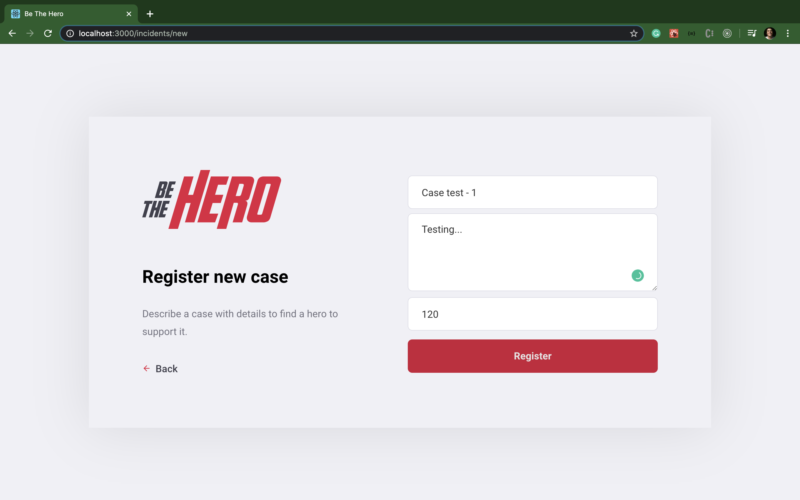

# Be-The-Hero-Frontend

This is the frontend of the **Be-The-Hero** project developed by [**_Rocketseat_**](https://rocketseat.com.br/), a Brazilian company that teaches Node.JS, ReactJS and React Native.
This is a project where I could learn many professional techniques that is used in "the real world".

## About the project

- The **Be-The-Hero** is an application where a Non-Governmental Organization can create a case in your session publishing a service that they did to ask some help as a payment.
- The **user** can access the app and contribute with a payment to some NGO for that specific service that the NGO has done.

## The frontend

The frontend was developed with [**_ReactJS_**](https://reactjs.org/) using [**_axios_**](https://www.npmjs.com/package/axios) for the http requests.
[**_react-router-dom_**](https://www.npmjs.com/package/react-router-dom) was used to handle the routes in this application.

**Login**

**Sign-up for an ID**

**Login-Id**

**Dashboard**

**New case**

**New Dashboard**

## Getting started

1.  Prerequisites

- npm

      npm install npm@latest -g

2. Installation

- Clone the repo

      git clone https://github.com/euguilhermegirardi/Be-The-Hero-Frontend.git

3. Install NPM packages

       npm install

4. Run the application

       npm run start

## Contributing

1.  Fork the project
2.  Create your feature branch (`git checkout -b feature/AmazingFeature`)
3.  Commit your changes (`git commit -m 'Add some AmazingFeature'`)
4.  Push to the branch (`git push origin feature/AmazingFeature`)
5.  Open a pull request

## License

